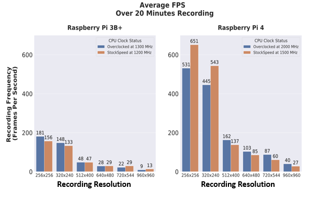
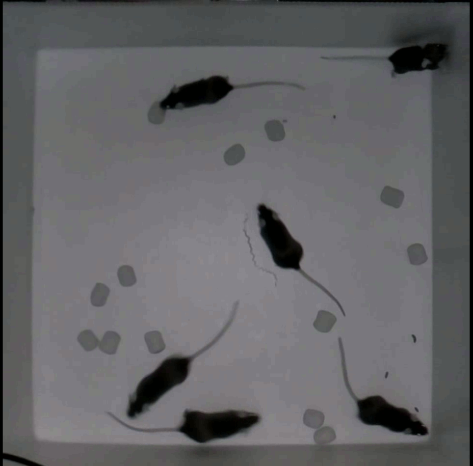
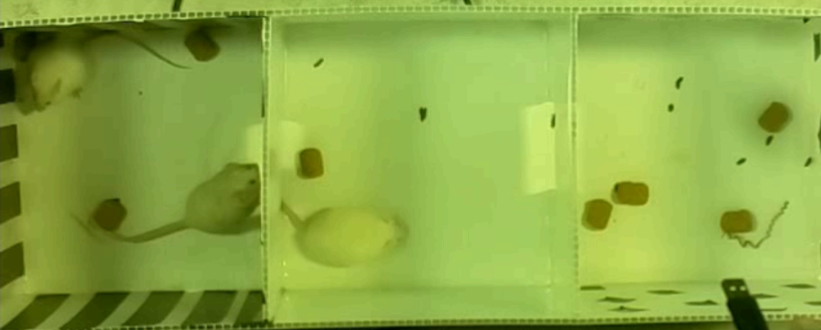
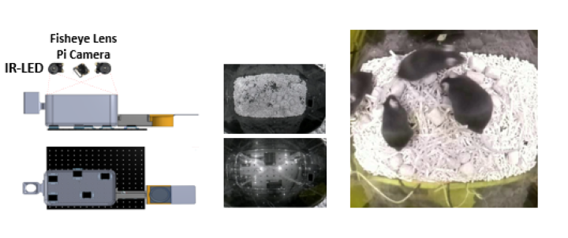

# Py-based SYstemfor Chronic monitoring of rOdent Species (Raspberry Pi recording modules)

To clone the repository, run the following in terminal. The recursive tag is required for the RFIDTagReader submodule to work correctly.
```
git clone --recursive https://github.com/ubcbraincircuits/NaturalMouseTracker_rpi
```
To install the setup scitpt by running in the cloned folder

```
sudo chmod 777 setup.sh
sudo ./setup.sh
```
To run the tracker cage, enter the command in the cloned folder
```
sudo python3 main2.py
```

Full video tutorial on setting up the software and editing recording settings:

```
https://youtu.be/E22OtdMjgwc
```

To setup a Raspberry Pi, please refer to the following links
```
https://www.tomshardware.com/reviews/raspberry-pi-set-up-how-to,6029.html
https://www.youtube.com/watch?v=wjWZhV1v3Pk
```

# Basic Concept and Essential Hardware

- Any Pi compatible camera can be used as long as there is an over headview of all mice
- Timestamp of each is written to a separate csv file
- RFID readings and their corresponding timestamps are also written in a csv file

### RFID System
- To identify and validate mouse 
- ID-20LA RFID tag readers setup at the custome locations at the bottom of the cage
- Locations of the readers must be sparse enough to minimize electromagnetic interference (approx 12cm)
- [RFID reader details](https://www.sparkfun.com/products/11828)
- [RFID reader base details](https://www.sparkfun.com/products/9963)
- RFID tag reader module developed by [Jamie Boyd](https://github.com/jamieboyd/RFIDTagReader)
- Aprroximate cost for each reader is 86 CAD
- Tags cost about 6 CAD and can be in the following [link](https://www.sparkfun.com/products/9416)


# FPS at Different Resolution on Pi3/4 

- can be record up to 40 fps at 960 x960 on a Raspiberry Pi 4

# Recording Rodents in Various Settings

## Traditional Open-Field/Three Chamber
 | 

## Custom Home-cage Setups


# PSCYO Analysis 
- Fully python based
- Yolov4 Detection and SORT tracking
- RFID matching methods based on Pandas
- More information can be found on the following [github link](https://github.com/tf4ong/PSYCO)


