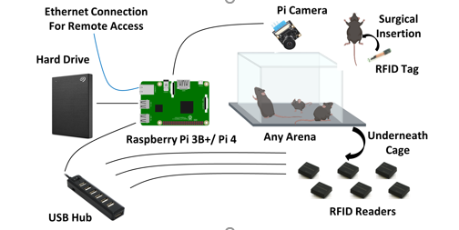
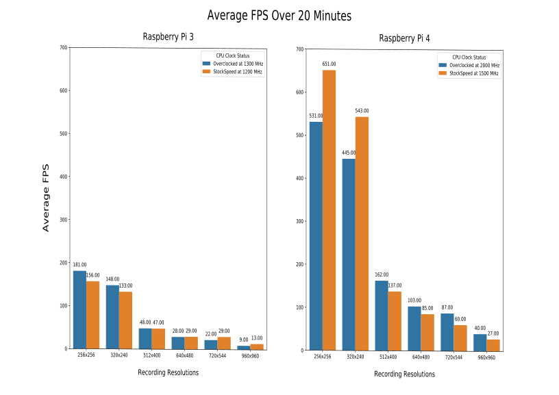

# Py-based SYstemfor Chronic monitoring of rOdent Species (Raspberry Pi recording modules)

To clone the repository, run the following in terminal. The recursive tag is required for the RFIDTagReader submodule to work correctly.
```
git clone --recursive https://github.com/ubcbraincircuits/NaturalMouseTracker_rpi
```
To install the setup scitpt by running in the cloned folder

```
sudo chmod 777 setup.sh
sudo ./setup.sh
```
To run the tracker cage, enter the command in the cloned folder
```
sudo python3 main2.py
```

Full video tutorial on setting up the software and editing recording settings:

```
https://youtu.be/E22OtdMjgwc
```

# Basic Concept

- Any Pi compatible camera can be used as long as there is an over headview of all mice
- Any number of RFID reader modules can be used. Up to 9 readers have been tested
- To add/remove readers change the nReader parameter in the config.ini file
- To disable readers set RFID to false in the config.ini file
# High frame and resolutions can be achieved 

- can be record up to 40 fpd at 960 x960 on a Raspiberry Pi 4

