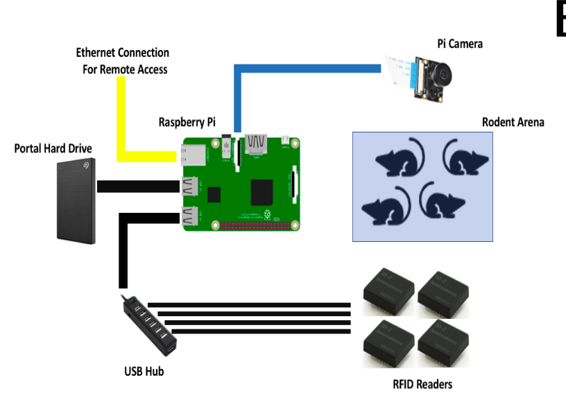
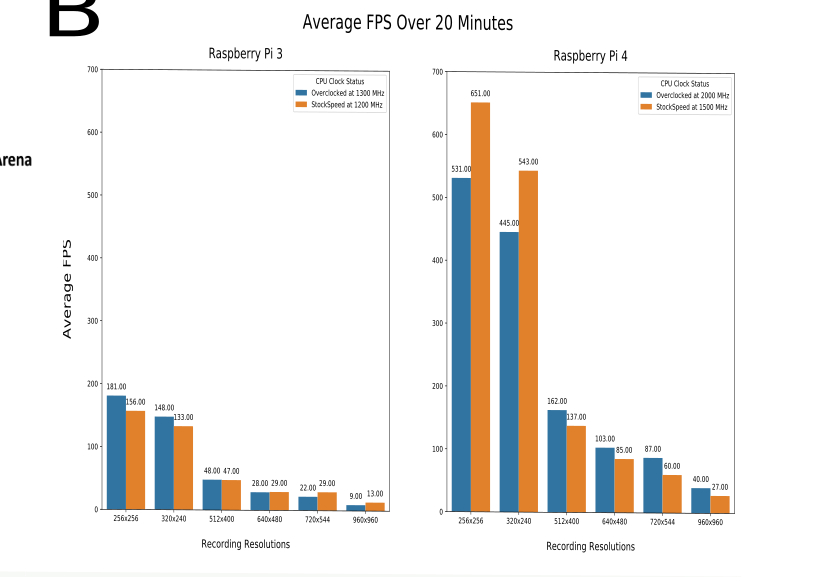

# Natural Mouse Tracker (Raspberry Pi recording modules)

To clone the repository, run the following in terminal. The recursive tag is required for the RFIDTagReader submodule to work correctly.
```
git clone --recursive https://github.com/ubcbraincircuits/NaturalMouseTracker_rpi
```

To run the tracker cage, use 

```
cd NaturalMouseTracker_rpi

python3 main2.py
```
# Basic Concept

- Any camera can be used as long as there is an over headview of all mice
- Any number of RFID reader modules can be used. Up to 9 readers have been tested
# High frame and resolutions can be achieved 

# Full compile of analysis TBH
